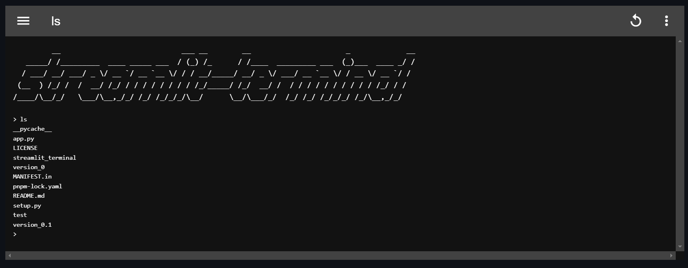

# streamlit-terminal

[Demo](https://akipg-streamlit-terminal-app-qgr550.streamlit.app/)



**Work in Progress**

## Installation

```bash
pip install git+https://github.com/takahc/streamlit-terminal
```

## Usage

### Basic Usage

You can embed a basic terminal in the app as follows:

```python
from streamlit_terminal import st_terminal

st_terminal(key="terminal1")
```

### Custom Command Execution

In this example, the terminal will load with the command `echo 'Hello, World!'` pre-filled. The user can click the **Run** button to execute it.

```python
from streamlit_terminal import st_terminal

st_terminal(key="terminal2", command="echo 'Hello, World!'")
```

### Multiple Terminals Example

You can also set up multiple terminals, each with different commands and configurations:

```python
import streamlit as st
from streamlit_terminal import st_terminal

# Set wide mode
st.set_page_config(layout="wide")

st.markdown("# Streamlit Terminal")

# Example 1: Basic Usage
st.markdown("## Example 1: Basic Usage")
st_terminal(key="terminal1")

# Example 2: Custom Command
st.markdown("## Example 2: Custom Command")
st_terminal(key="terminal2", command="echo 'Hello World'")

# Example 3: Custom Command with adjustable height
st.markdown("## Example 3: Custom Command with height")
st_terminal(key="terminal3", command="python -u test/clock.py", height=600)
```

## Development

### Run app in development mode

1. **Clone the repository**: Download the `streamlit-terminal` repository to your local machine.
    ```bash
    git clone https://github.com/akipg/streamlit-terminal.git
    ```

2. **Navigate to the project directory**: Change into the project’s main directory.
    ```bash
    cd streamlit-terminal
    ```

3. **Install the required dependencies**: Install Streamlit to run the application.
    ```bash
    pip install streamlit
    ```

4. **Modify the `__init__.py` file**: Set `_RELEASE = False` in `streamlit_terminal/__init__.py` for development mode.
    ```python
    _RELEASE = False
    ```

5. **Run the application**: Start the Streamlit app.
    ```bash
    streamlit run app.py

### Run Frontend

To set up the development environment for the frontend:

1. **Navigate to the frontend directory**: Move into the frontend Vue.js project directory.
    ```bash
    cd streamlit_terminal/frontend-vue
    ```

2. **Install dependencies**: Install all required Node.js dependencies using `pnpm`.
    ```bash
    pnpm i
    ```

3. **Start the development server**: Run the frontend development server with hot-reload enabled.
    ```bash
    pnpm run dev
    ```


